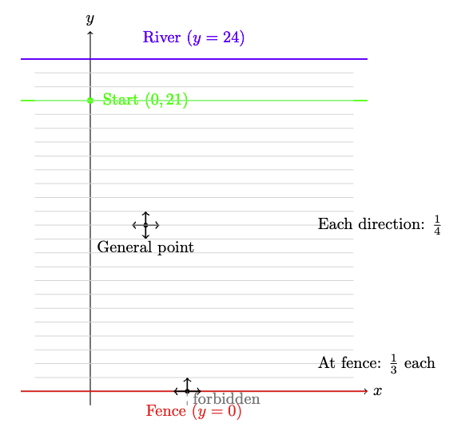
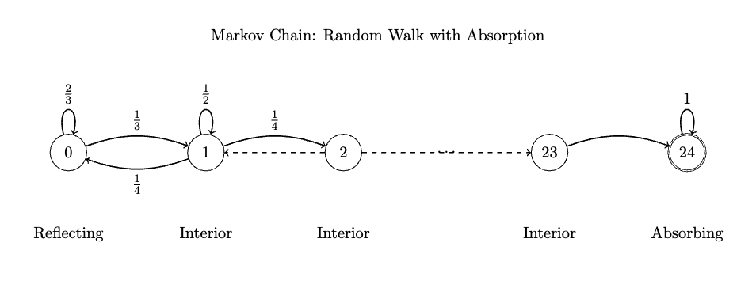

# From lilypads to expectation via Markov Chains

### Motivational problem
We start by considering this motivational problem:

Freddy the frog is jumping around the coordinate plane searching for a river, which lies on the horizontal line $y = 24$. A fence is located at the horizontal line $y = 0$. On each jump Freddy randomly chooses a direction parallel to one of the coordinate axes and moves one unit in that direction. When he is at a point where $y=0$, with equal likelihoods he chooses one of three directions where he either jumps parallel to the fence or jumps away from the fence, but he never chooses the direction that would have him cross over the fence to where $y < 0$. Freddy starts his search at the point $(0, 21)$ and will stop once he reaches a point on the river. Find the expected number of jumps it will take Freddy to reach the river.

*Source: 2014 AIME problem 13*

From a recursive POV, we want to decompose the large problem into smaller subproblems. By starting from a random point, you quickly notice that you can either jump left or right, which keeps you on the same line, or jump up or down, which moves your $y$-coordinate up or down. 

This process terminates when the frog reaches $y = 24$, and we are curious about the expected value of the number of steps required until we reach termination. It seems logical that we can categorize each horizontal line as one state, then there are a total of 25 states, and we can model this using a markov chain because the transition between states only depend on the previous state. 

<!-- #### 1. Reflecting State
A **reflecting state** is a state where transitions are restricted in such a way that the process cannot move beyond this state in a particular direction. Instead, the process "reflects" back into the allowed states. 

- **Example:** In the problem, the horizontal line $y = 0$ acts as a reflecting boundary. Freddy cannot jump below this line (to $y < 0$). If he attempts to move downward, he is instead forced to move parallel to the fence or upward.

#### 2. Interior State
An **interior state** is a state that is not a boundary or terminal state. Transitions from an interior state can occur in multiple directions, and the process can move freely to other states.

- **Example:** Any horizontal line where $0 < y < 24$ is an interior state. For instance, at $y = 21$, Freddy can jump up, down, left, or right, and the process continues.

#### 3. Absorbing State
An **absorbing state** is a state that, once entered, cannot be left. The process terminates when it reaches this state.

- **Example:** The horizontal line $y = 24$ is an absorbing state. Once Freddy reaches this line (the river), he stops jumping, and the process ends.
 -->

Let's call the expected number of steps to go from state $i$ to state $24$ as $s_i$. We want to find 
$s_{21}$. To consider the transition process for expected values, we note that this is actually a recursive process:
The expected number of steps to go from state 21 to 24 is in fact related to the expected number of steps for its neighbors. 21 has a 1/2 chance to stay in itself and has 1/4 chance to go up or down, so we can encode this as 

$$s_{21} = 1 + s_{20}/4 + s_{22}/4 + s_{21} / 2$$

We add $1$ because it takes a step to make each transition. Now $21$ is just an ordinary interior state and we could have replaced it with any interior state, so we say that 

$s_{i} = 1 + s_{i-1}/4 + s_{i+1}/4 + s_{i} / 2$ $\quad$ for $1 \le i \le 23$.

For the two boundary conditions, 
$$s_{0} = 1 + 2/3 s_0 + 1/3 s_1$$
$$s_{24} = 0.$$

Consequently, we have a system of (how many) equations that we can solve for, we start with $s_0$ and rearrange to get 
$$s_0 = s_1 + 3$$
$$2s_1 = 4 + s_0 + s_2$$
$$2s_1 = 4 + 3 + s_1 + s_2$$
$$s_1 = 7 + s_2$$
$$s_2 = 11 + s_3$$
so we see that there is an arithemetic sequence pattern with common difference $4$, now we can telescope all the way to $s_{23}$ with 
$$s_{23} = 95 + s_{24} = 95$$
and then we work our way back to get 
$$s_{22} = 91 + s_{23} = 186$$
$$s_{21} = 87 + s_{22} = \boxed{273}.$$

### Can we think more about markov chains?

As we saw with our own eyes, a markov chain is a directed graph with probabalistic edges, so we may also want to define a transition matrix for this graph with 
$$M = \begin{bmatrix}
    2/3 & 1/4 & 0 & \dots & 0 & 0 \\
    1/3 & 1/2 & 1/4 & \dots & 0 & 0 \\
    0 & 1/4 & 1/2 & \dots & 0 & 0 \\
    0 & 0 & 1/4 & \dots & 0 & 0 \\
    \vdots & \vdots & \vdots & & \vdots & \vdots \\
    0 & 0 & 0 & \dots & 1/4 & 0\\
    0 & 0 & 0 & \dots & 1/2 & 0\\
    0 & 0 & 0 & \dots & 1/4 & 1\\
\end{bmatrix}$$

$M$ is a $25 \times 25$ matrix where each column sums up to $1$. Entries $M_{ij}$ represents the probability to go form state $i$ to state $j$. 

We start with the intial configuration with this one hot vector
$$v_0 = \begin{bmatrix}
    0 \\
    0 \\
    \vdots \\
    1 \quad (row 21) \\
    0 \\ 
    0 \\
    0 \\
\end{bmatrix}$$

and each time we transition we consider $v_1 = Mv_0$, $v_i = Mv_{i-1}$. 

