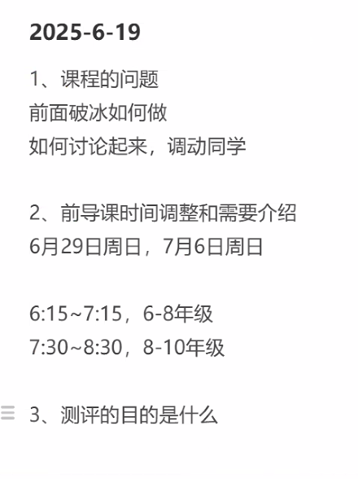

# 06 19 2025

Think about pre-class icebreakers
Upload documents 

On advertisement

Think more about the test

Documents

## Building 
Planner and habit builder are good blocks
We can also add a chat block using text or whatsapp or wechat
- Wechat bot tutorial https://chatbotsmagazine.com/building-chatbots-for-wechat-part-1-dba8f160349
- Whatsapp bot https://github.com/YonkoSam/whatsapp-python-chatbot
- Wechat bot #1 https://github.com/wangrongding/wechat-bot
- Wecaht bot #2 https://github.com/AutumnWhj/ChatGPT-wechat-bot
And also need some experience with building memory/tools -> MCP

English consultant = planner + habit builder + interface for communication + memory
Motivational coach = similar, expect direct access
Researcher = focus on tools 
Entreprenuer = focus on implementation

## Research
Adamorph optimizer is intersting 
Perform more experiments.

## Learning
Keep working on CMU's CS class and / or stanford's CS class
 
 